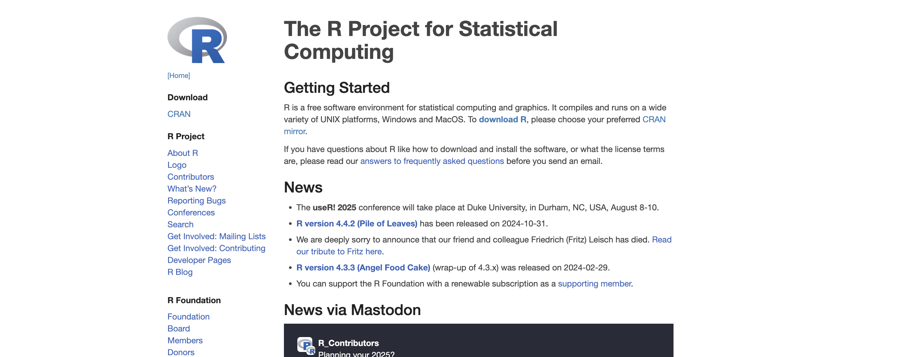
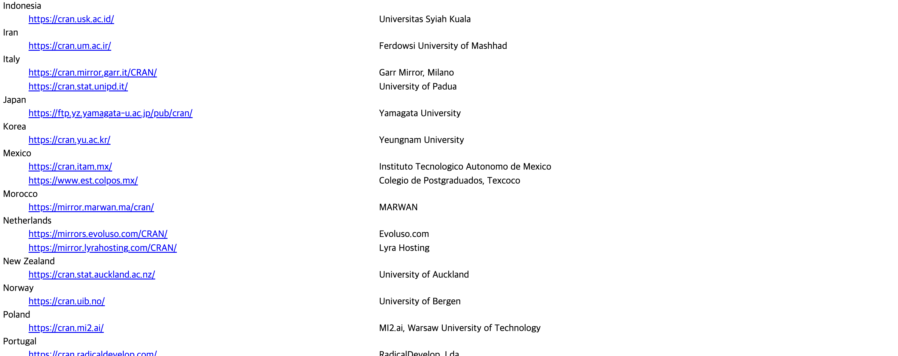
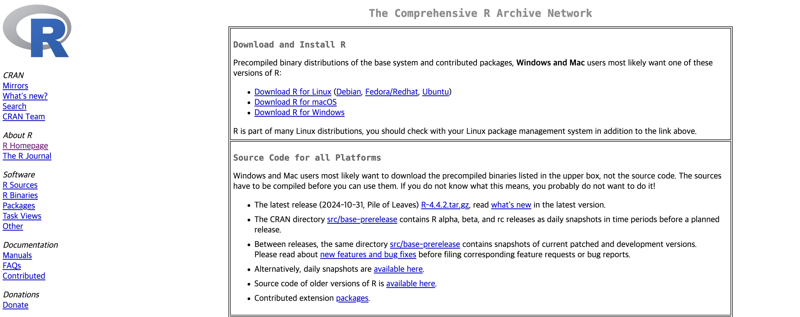
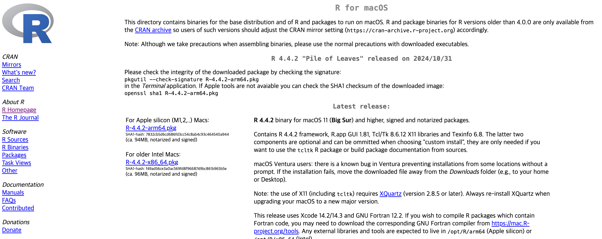
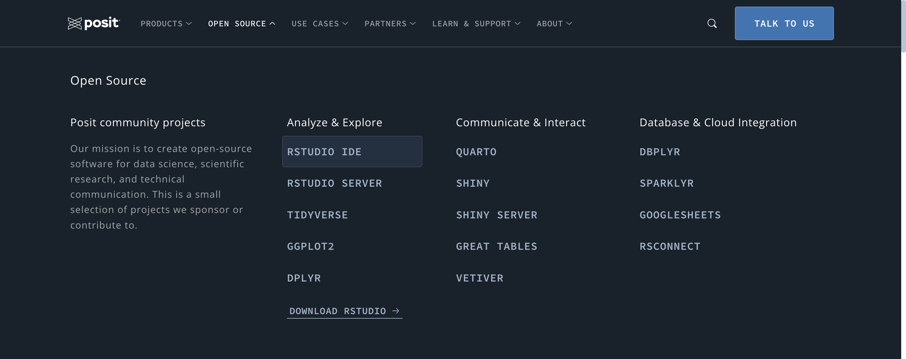
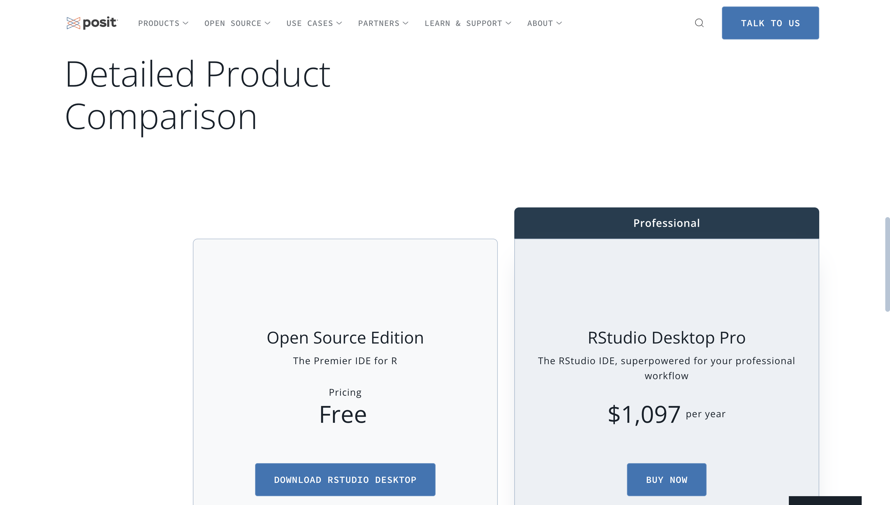
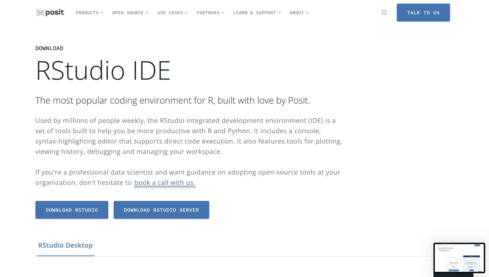
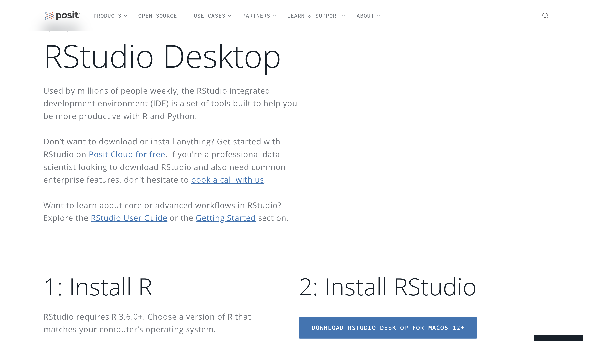

# [4과목 - 2장] R 프로그래밍 기초 1

---
## ⛳️ 학습 목표 ⛳️
#### 0. R GUI 실행을 위한 환경을 설정한다(맥북 기준)
#### 1. R GUI를 실행하여 프로그래밍을 할 수 있다.
#### 2. R GUI의 환경설정을 조정하고 편리한 기능들을 숙지한다.
#### 3. R 패키지를 이해하고 CRAN을 통해 다운로드하고 실행할 수 있다.
#### 4. R 파일을 실행하고 배치작업을 할 수 있다.
---

#### 0. R GUI 실행을 위한 환경 설정
  (1) R과 R GUI, RStudio
    - **R**은 통계 분석에 특화된 프로그래밍 언어로, 데이터 분석 시 많이 사용됩니다.
    - 다만, R을 직접 입력하는것은 상당히 불편하고 비효율 적이어서, 통합 개발 환경(IDE: Integrated Development Environment)인 **R GUI**(Graphic User Interface)라는 프로그램을 사용합니다.
    - 그리고 **R Studio**는 R을 보다 효과적이고 편하게 사용할 수 있도록 돕는 별도의 GUI 프로그램입니다.
    - 결과적으로, **R 언어를 사용하기 위해 총 2개의 GUI를 설치**해야 합니다.

  (2) R GUI 다운로드 및 설치
    - 다운로드 사이트 : https://www.r-project.org/
    - 왼쪽 메뉴에 있는 'CRAN'을 누릅니다.
    

      
    

    - 스크롤을 내려 'Korea'를 찾고, 링크를 눌러줍니다.
    

      
    

    - 'Download R for macOS'를 클릭 합니다.(맥북을 사용하는 경우)
    

      
    

    - 환경에 맞는 패키지를 클릭하여 다운로드 합니다.
    - M3인 경우, 'R-4.4.2-arm64.pkg'를 선택합니다.
    

      
    

    - 다운로드 받은 파일을 선택해 실행합니다.
    - '계속'과 '동의'를 눌러 설치를 완료합니다.
    - 설치를 완료하면 '응용 프로그램' 폴더에 아래와 같은 'R' 아이콘이 존재하는지 확인합니다.
    

      
    

  (3) R Studio 다운로드 및 설치
    - 다운로드 사이트 : https://posit.co/downloads/ 
    - 사이트 상단의 'OPEN SOURCE'를 누르고, 아래의 'RSTUDIO IDE'를 눌러주세요.
    

      
    

    - 사이트 왼쪽의 'Open Source Edition'을 누릅니다.
    

      
    

    - 사이트 왼쪽 중앙의 'DOWNLOAD RSTUDIO'을 누릅니다.
    

      
    

    - 사이트 오른쪽 중앙의 'DOWNLOAD RSTUDIO DESKTOP~'을 누릅니다.
    

      
    

    - 다운로드 받은 파일을 선택해 실행합니다.
    - 설치를 완료합니다.
    - 설치를 완료하면 '응용 프로그램' 폴더에 아래와 같은 'R Studio' 아이콘이 존재하는지 확인합니다.
    

      
    
