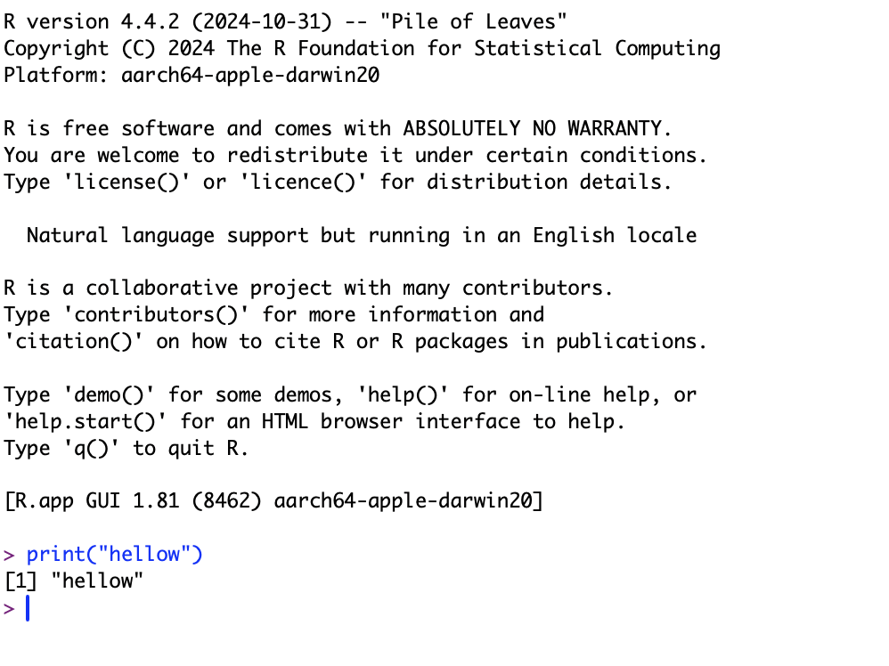

# [4과목 - 2장] R 프로그래밍 기초 1

---
## ⛳️ 학습 목표 ⛳️
#### 0. R GUI 실행을 위한 환경을 설정한다(맥북 기준)
#### 1. R GUI를 실행하여 프로그래밍을 할 수 있다.
#### 2. R GUI의 환경설정을 조정하고 편리한 기능들을 숙지한다.
#### 3. R 패키지를 이해하고 CRAN을 통해 다운로드하고 실행할 수 있다.
#### 4. R 파일을 실행하고 배치작업을 할 수 있다.
---

#### 1. R GUI를 실행하고 print('hello')를 실행합니다.
  (1) 응용프로그램의 R 아이콘을 클릭하여 실행
    - R은 통계 분석에 특화된 프로그래밍 언어로, 데이터 분석 시 많이 사용됨
    - 터미널 처럼 생긴 창에 **'print("hello")'를 입력해서 출력된 결과를 확인**합니다.
    

      
    

